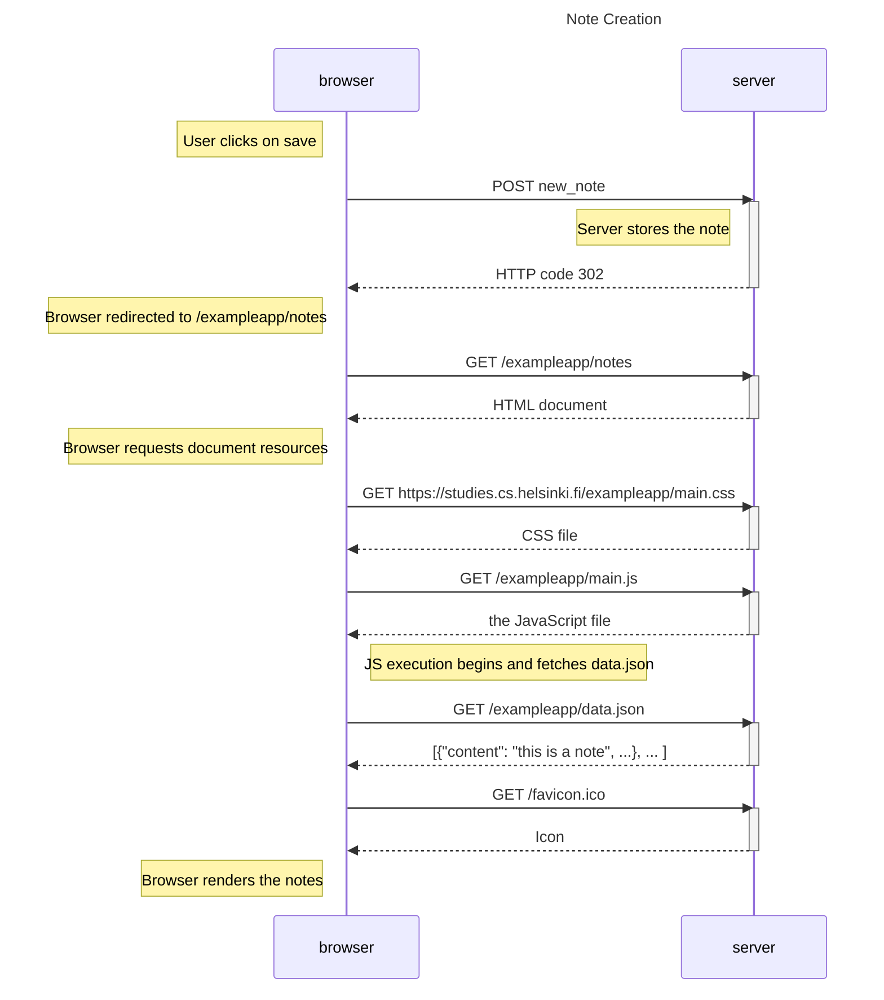
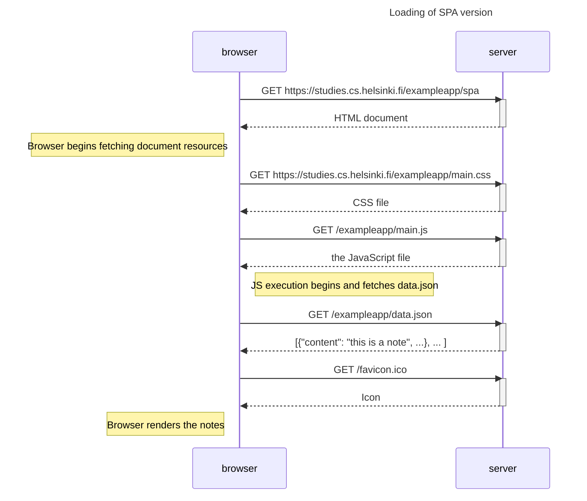
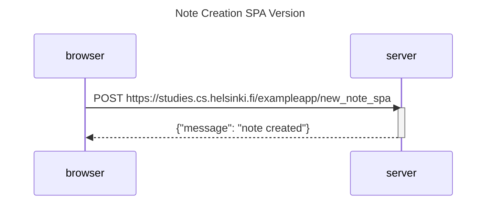

```mermaid
sequenceDiagram
title Note Creation
    participant browser
    participant server

    Note left of browser: User clicks on save

    browser->>server: POST new_note
    activate server
    Note left of server: Server stores the note
    server-->>browser: HTTP code 302
    deactivate server 

    Note left of browser: Browser redirected to /exampleapp/notes

    browser->>server: GET /exampleapp/notes
    activate server
    server-->>browser: HTML document
    deactivate server

    Note left of browser: Browser requests document resources

    browser->>server: GET https://studies.cs.helsinki.fi/exampleapp/main.css
    activate server
    server-->>browser: CSS file
    deactivate server

    browser->>server: GET /exampleapp/main.js
    activate server
    server-->>browser: the JavaScript file
    deactivate server

    Note right of browser: JS execution begins and fetches data.json

    browser->>server: GET /exampleapp/data.json
    activate server
    server-->>browser: [{"content": "this is a note", ...}, ... ]
    deactivate server

    browser->>server: GET /favicon.ico
    activate server
    server-->>browser: Icon
    deactivate server

    Note left of browser: Browser renders the notes
```

```mermaid
sequenceDiagram
title Loading of SPA version
    participant browser
    participant server

    browser->>server: GET https://studies.cs.helsinki.fi/exampleapp/spa
    activate server
    server-->>browser: HTML document
    deactivate server 

    Note left of browser: Browser begins fetching document resources

    browser->>server: GET https://studies.cs.helsinki.fi/exampleapp/main.css
    activate server
    server-->>browser: CSS file
    deactivate server

    browser->>server: GET /exampleapp/main.js
    activate server
    server-->>browser: the JavaScript file
    deactivate server

    Note right of browser: JS execution begins and fetches data.json

    browser->>server: GET /exampleapp/data.json
    activate server
    server-->>browser: [{"content": "this is a note", ...}, ... ]
    deactivate server

    browser->>server: GET /favicon.ico
    activate server
    server-->>browser: Icon
    deactivate server

    Note left of browser: Browser renders the notes
```

```mermaid
sequenceDiagram
title Note Creation SPA Version
    participant browser
    participant server

    browser->>server: POST https://studies.cs.helsinki.fi/exampleapp/new_note_spa
    activate server
    server-->>browser: {"message": "note created"}
    deactivate server 
```